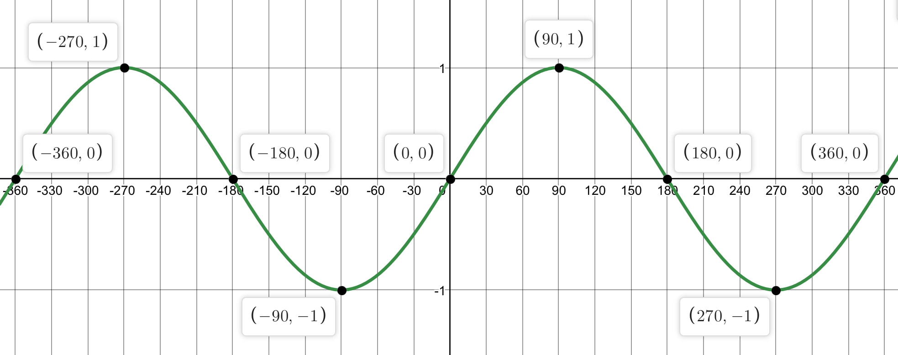

A user in the OpenGOAL Discord today asked about a bug they encountered in Jak 2 and 3 where the Dark Eco HUD would stop flashing after reaching around 70% game progress. They claimed that the issue even persisted after saving, rebooting console, and loading the save.

I had never heard of such a bug, so my first guess was that this was another high FPS bug. But the user said no, it happens at 60 FPS and on console as well. Plus the claim that it only happened after progressing far enough into the game, and that it persisted after a reboot was strange...

{/* truncate */}

<ReactPlayer
  controls
  src={"https://youtu.be/3V2GneLSY14?t=9362"}
  width="640px"
  height="360px"
/>

You can see in this example that the Dark Jak icon stops flashing at around 2:36:05. The Dark Eco meter stops flashing later on around the 4.5 hour mark, just before the boss fight in Mars Tomb.

### Investigation

I started poking around the HUD code, looking for the code that added the flashing effect. My guess was that it would be referencing some kind of `time-frame` in order to flash with a consistent frequency.

In Jak 2, there are two separate HUD elements involved - `hud-health` which includes the Dark Eco meter, and `hud-dark-eco-symbol` which handles the Jak / Dark Jak icon. Sure enough in the `draw` method for both of these, we can see the flashing effect is achieved by scaling the sprite color based on a `sine` function involving the `game-clock`:

```opengoal
(defmethod draw ((this hud-health))
  ...
  (let ((v1-12
          (+ (the int (* 127.0 (sin (* 182.04445 (the float (* (-> *display* game-clock frame-counter) 2)))))) 127)
          )
        )
    (set! (-> this sprites 1 color x) v1-12)
    (set! (-> this sprites 1 color y) v1-12)
    (set! (-> this sprites 1 color z) v1-12)
    )
...

(defmethod draw ((this hud-dark-eco-symbol))
  ...
       (let ((v1-31
               (+ (the int (* 15.0 (sin (* 182.04445 (the float (* (-> *display* game-clock frame-counter) 4)))))) 160)
               )
             )
         (set! (-> this sprites 0 color x) v1-31)
         (set! (-> this sprites 0 color y) v1-31)
         (set! (-> this sprites 0 color z) v1-31)
         )
       )
```

As I expected, there was nothing related to checking game progression in this code, so what's causing the bug? Let's look more closely at the math for the flash effect.

The `(-> *display* game-clock frame-counter)` tracks how long you've been playing the game on this save file (e.g. for the playtime display on the save/load screens). This just an integer counting the number of ticks (300 ticks / sec) since the game was started (technically it start at `(seconds 1000) = 300000`). This doesn't include time where the game is paused or in cutscenes.

The bug lies within the `(sin (* 182.04445 (the float (* (-> *display* game-clock frame-counter) <multiplier>))))` calculation - it turns out GOAL's `sin` breaks down when you feed it really big float values (~2147483584.0 or bigger):

```opengoal
gc> (sin 2147483400.0)
-1127675244        #xffffffffbcc90a94             -0.0245        #<invalid object #xbcc90a94>

gc> (sin 2147483500.0)
-1136062860        #xffffffffbc490e74             -0.0122        #<invalid object #xbc490e74>

gc> (sin 2147483600.0)
0        #x0              0.0000        0

gc> (sin 2147483700.0)
0        #x0              0.0000        0

gc> (sin 2147483800.0)
0        #x0              0.0000        0

gc> (sin 2147483900.0)
0        #x0              0.0000        0

gc> (sin 9999999999.0)
0        #x0              0.0000        0
```

Once your `(-> *display* game-clock frame-counter)` gets large enough, `sin` starts to return `0.0` no matter what, effectively pausing the flash effect. 

For example, the code for the Dark Jak icon has a `<multipler>` of 4, so it will stop flashing after approximately `(2147483584.0 / (182.04445 * 4) - 300000) / (300 * 60 * 60) = 2.45` hours, which roughly matches the example video from earlier.

So the bug isn't related to game progression, but rather game playtime! The `(-> *display* game-clock frame-counter)` value is stored in your savefile, which explains why the bug persists even after rebooting and loading your savefile. This bug also affects the Light Eco meter in Jak 3.

### The Fix

Thankfully dass saved me some head scratching and pointed out that the `(* 182.04445` is effectively the same as the `degrees` macro (65536 / 360 = 182.0444):

```opengoal
(defglobalconstant DEGREES_PER_ROT 65536.0)

;; this was deg in GOAL
(defmacro degrees (x)
  "Convert number to degrees unit.
   Will keep a constant float/int constant."
  (cond
    ((or (float? x) (integer? x))
     (* DEGREES_PER_ROT (/ (+ 0.0 x) 360.0))
     )
    (#t
     `(* (/ (the float ,x) 360.0)
         DEGREES_PER_ROT
         )
     )
    )
  )
```

So first, we can refactor the code to be a bit more readable by using the `degrees` macro:

```diff
(defmethod draw ((this hud-dark-eco-symbol))
  ...
       (let ((v1-31
-              (+ (the int (* 15.0 (sin (* 182.04445 (the float (* (-> *display* game-clock frame-counter) 4)))))) 160)
+              (+ (the int (* 15.0 (sin (degrees (* (-> *display* game-clock frame-counter) 4))))) 160)
```

Now we see the `frame-counter` (times the `<multiplier>`) is being converted to degrees before calling `sin` on it. Since the sine function fluctuates between -1 and 1 and back every 360 degrees, this results in the flash effect cycling every `360 / <multiplier>` ticks.



Knowing this, we can modulo the value by 360 and still get the same result from `sin`:

```diff
(defmethod draw ((this hud-dark-eco-symbol))
  ...
       (let ((v1-31
-              (+ (the int (* 15.0 (sin (* 182.04445 (the float (* (-> *display* game-clock frame-counter) 4)))))) 160)
+              (+ (the int (* 15.0 (sin (degrees (mod (* (-> *display* game-clock frame-counter) 4) 360))))) 160)
```

By doing this, we ensure the value we pass to `sin` is between (-360.0, 360.0), and avoid any large float values that would cause it to break. Now no matter how long you play, i.e. how big `(-> *display* game-clock frame-counter)` gets, the `sin` call should function correctly, and the HUD elements will keep flashing correctly!

### References

- [PR #4285](https://github.com/open-goal/jak-project/pull/4285)