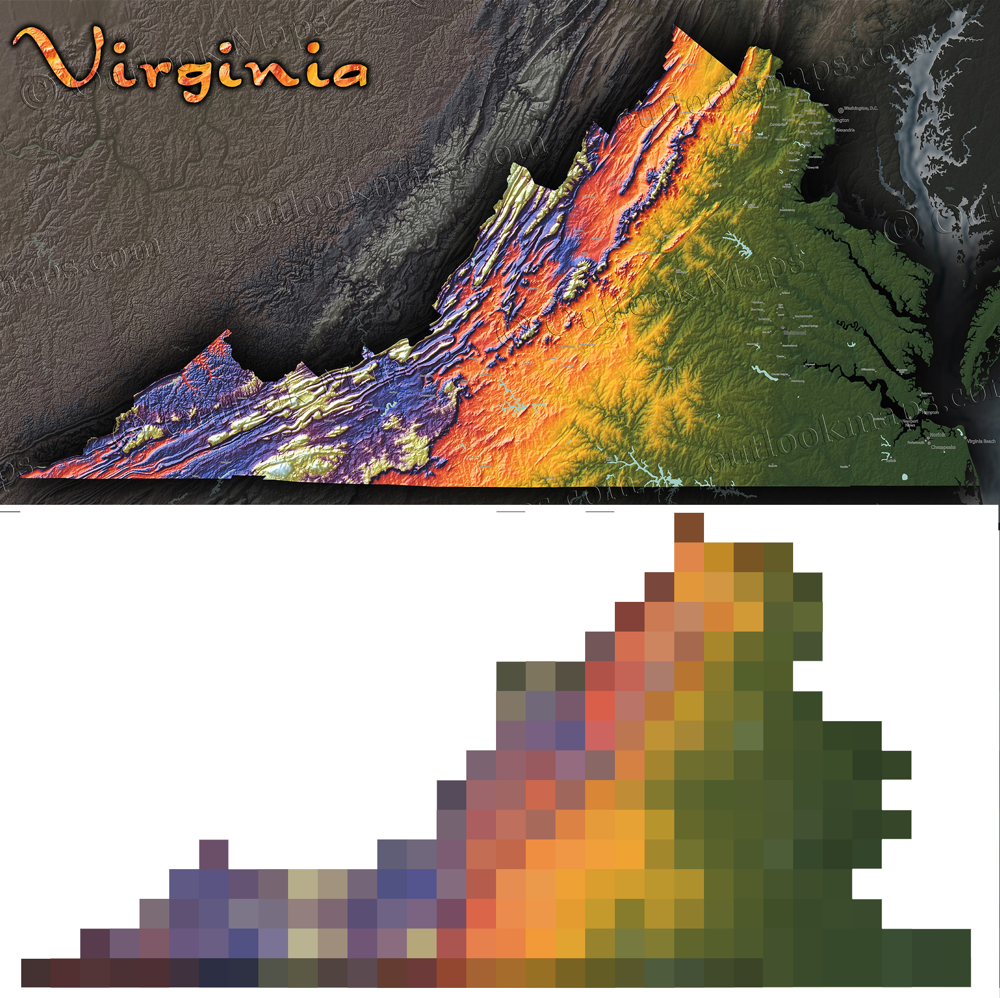

In Jak 3 speedrunning there is a trick sometimes used called the "Super Fast Hover Bike Glitch", or SFHBG, where you use Light Jak Flash Freeze and the Wave Concussor to launch zoomers at crazy high speeds. However on console, if you overdo the launch (e.g. charge the Wave Concussor too long) the game will actually crash upon launching the zoomer. Let's look into what causes this crash!

{/* truncate */}

<ReactPlayer
  controls
  src={"https://youtu.be/KraQx8K7neI?t=38"}
  width="640px"
  height="360px"
/>

### Pinpointing the crash

First let's see if we can catch exactly where the crash happens by attaching the debugger. In the REPL, after we've compiled (ran `(mi)`) and launched the game in debug mode, we can run `(lt)` to connect the REPL, and then `(dbgc)` to connect the GOAL debugger.

Now we just need to reproduce the crash, and in the REPL we'll see it catches the exception:

`Target raised an exception (EXCEPTION_ACCESS_VIOLATION [0xC0000005]). Run (:di) to get more information.`

Running `(:di)` will show us the stack trace:

```diff
In function (method get-height-at-point xz-height-map) in segment 0 of obj height-map, offset_obj 0x817, offset_func 0xf3

height-map.gc:99
              (+ (+ (min a2-0 (+ v1-0 -2)) (* (min a1-1 (+ a3-0 -2)) v1-0) 0) (the-as int (the-as pointer (-> this data))))
                                                 ^
  [0x18D4BE6AA24] mov rdi, r12                               mov igpr-48, igpr-24
  [0x18D4BE6AA27] mov rsi, r10                               mov igpr-49, igpr-45
  [0x18D4BE6AA2A] add r9, r15                                call igpr-50 (ret igpr-47) (args igpr-48 igpr-49)
  [0x18D4BE6AA2D] call r9

height-map.gc:99
              (+ (+ (min a2-0 (+ v1-0 -2)) (* (min a1-1 (+ a3-0 -2)) v1-0) 0) (the-as int (the-as pointer (-> this data))))
                                              ^
  [0x18D4BE6AA30] imul eax, ebp                              imul igpr-52, igpr-32
  [0x18D4BE6AA33] movsxd rax, eax

height-map.gc:99
              (+ (+ (min a2-0 (+ v1-0 -2)) (* (min a1-1 (+ a3-0 -2)) v1-0) 0) (the-as int (the-as pointer (-> this data))))
                    ^
  [0x18D4BE6AA36] add r11, rax                               addi igpr-43, igpr-52
  [0x18D4BE6AA39] xor r9, r9                                 mov-ic igpr-53, 0
  [0x18D4BE6AA3C] add r11, r9                                addi igpr-43, igpr-53

height-map.gc:99
              (+ (+ (min a2-0 (+ v1-0 -2)) (* (min a1-1 (+ a3-0 -2)) v1-0) 0) (the-as int (the-as pointer (-> this data))))
                 ^
  [0x18D4BE6AA3F] mov r9d, [r15+rbx*1+0x1C]                  mov igpr-55, [igpr-3 + 28]
  [0x18D4BE6AA44] add r11, r9                                addi igpr-54, igpr-57

height-map.gc:102
          (f3-3 (the float (-> a1-7 0)))
                   ^
- [0x18D4BE6AA47] movsx r9, byte ptr [r15+r11*1] mov igpr-61, [igpr-59 + 0]
  [0x18D4BE6AA4C] cvtsi2ss xmm7, r9d                         i2f ifpr-60, igpr-61

height-map.gc:103
          (f4-1 (the float (-> a1-7 1)))
                   ^
  [0x18D4BE6AA51] movsx r9, byte ptr [r15+r11*1+0x01]        mov igpr-64, [igpr-59 + 1]
  [0x18D4BE6AA57] cvtsi2ss xmm6, r9d                         i2f ifpr-63, igpr-64

height-map.gc:104
          (f2-8 (the float (-> a1-7 v1-0)))
                              ^
  [0x18D4BE6AA5C] mov r9, rbp                                mov igpr-66, igpr-32

height-map.gc:104
          (f2-8 (the float (-> a1-7 v1-0)))
                   ^
  [0x18D4BE6AA5F] add r9, r11                                addi igpr-69, igpr-59
  [0x18D4BE6AA62] movsx r9, byte ptr [r15+r9*1]              mov igpr-68, [igpr-69 + 0]
  [0x18D4BE6AA67] cvtsi2ss xmm5, r9d                         i2f ifpr-67, igpr-68

rax: 0x0000000000000000 rcx: 0x0000000000147d21 rdx: 0x000000003c888889 rbx: 0x00000000022dd8f0 
rsp: 0x0000018d49d0ef50 rbp: 0x0000000000000050 rsi: 0x0000000000000000 rdi: 0x0000000000000000 
 r8: 0xfffffffffffffffe  r9: 0x00000000022db5f0 r10: 0x000000000000006e r11: 0xffffffff822db5f0 
r12: 0x0000000000000000 r13: 0x000000000028f884 r14: 0x0000000000147d21 r15: 0x0000018d49b90000 
rip: 0x0000018d4be6aa47
```

These stack traces can seem intimidating at first, but we really just want to focus on the code one line above where the debugger shows the breakpoint (the line in red):

```lisp
height-map.gc:99
              (+ (+ (min a2-0 (+ v1-0 -2)) (* (min a1-1 (+ a3-0 -2)) v1-0) 0) (the-as int (the-as pointer (-> this data))))
                 ^
```

Let's look at this in the source code for a bit more context:

```opengoal
(defmethod get-height-at-point ((this xz-height-map) (arg0 vector))
  (let* ((f0-1 (fmax 0.0 (* (-> this x-inv-spacing) (- (-> arg0 x) (-> this x-offset)))))
         (f2-4 (fmax 0.0 (* (-> this z-inv-spacing) (- (-> arg0 z) (-> this z-offset)))))
         (a2-0 (the int f0-1))
         (a1-1 (the int f2-4))
         (f1-7 (- f0-1 (the float a2-0)))
         (f0-4 (- f2-4 (the float a1-1)))
         (v1-0 (-> this x-dim))
         (a3-0 (-> this z-dim))
         (a1-7
           (the-as
             (pointer int8)
             (+ (+ (min a2-0 (+ v1-0 -2)) (* (min a1-1 (+ a3-0 -2)) v1-0) 0) (the-as int (the-as pointer (-> this data))))
             )
           )
```

It's a bit hard to read with the generated variable names, but this is computing `a1-7` as a pointer to some address relative to `(-> this data)` as a starting point. Presumably the crash is caused by this pointing to an invalid memory address under some scenarios.

### Making sense of `xz-height-map`

What exactly is `this` in this context, and what's in its `data` field?

Well, we're in the `get-height-at-point` method for an `xz-height-map`, so we can look at that type's definition:

```opengoal
(deftype xz-height-map (structure)
  ((offset         float  3)
   (x-offset       float  :overlay-at (-> offset 0))
   (y-offset       float  :overlay-at (-> offset 1))
   (z-offset       float  :overlay-at (-> offset 2))
   (x-inv-spacing  float)
   (z-inv-spacing  float)
   (y-scale        float)
   (dim            int16  2)
   (x-dim          int16  :overlay-at (-> dim 0))
   (z-dim          int16  :overlay-at (-> dim 1))
   (data           (pointer int8))
   )
```

Not the most helpful... where is this actually used, and for what purpose? Let's peek at `traffic-height-map.gc` where I found the type referenced:

```opengoal
(define *traffic-height-map* (new 'static 'xz-height-map
                               :offset (new 'static 'array float 3 -3178496.0 71680.0 -3178496.0)
                               :x-inv-spacing 0.000010172526
                               :z-inv-spacing 0.000010172526
                               :y-scale 4096.0
                               :dim (new 'static 'array int16 2 80 #x70)
                               :data (new 'static 'array int8 8960
                                 ;; ~9000 lines of integers here, redacted
                                 )
                               )
        )
```

So `data` is a giant list of integers, and while it's still not immediately clear what this is, if we think about the names `xz-height-map` and `get-height-at-point`, and look at the implementation it begins to make a bit more sense. We can update the variable names and linebreaks to make it a bit easier to read:

```opengoal
(defmethod get-height-at-point ((this xz-height-map) (arg0 vector))
  (let* ((x-rel (fmax 0.0 (* (-> this x-inv-spacing) (- (-> arg0 x) (-> this x-offset)))))
         (z-rel (fmax 0.0 (* (-> this z-inv-spacing) (- (-> arg0 z) (-> this z-offset)))))
         (x-int (the int x-rel))
         (z-int (the int z-rel))
         (x-frac (- x-rel (the float x-int)))
         (z-frac (- z-rel (the float z-int)))
         (x-dim (-> this x-dim))
         (z-dim (-> this z-dim))
         (a1-7
           (the-as
             (pointer int8)
             (+ 
                (+ (min x-int 
                        (+ x-dim -2))
                   (* (min z-int 
                           (+ z-dim -2))
                      x-dim) 
                   0)
                (the-as int (the-as pointer (-> this data))))
             )
           )
```

The `get-height-at-point` method takes in a vector, and we can see the method only really cares about its X and Z coordinates. It uses the `x-offset`/`z-offset`, `x-inv-spacing`/`z-inv-spacing`, and `x-dim`/`z-dim` values to efffectively convert the coordinates into integer "buckets", and points to some offset from `data` using these values. 

In other words, `data` is a 2D table of values, and it's looking up the value from this table based on the X and Z coordinates. The values represent the height at which zoomers should float, as this height varies throughout Haven City - you can sort of think of the `data` table like a pixelated version of a topography map:



### So when does it crash?

Now that we have a basic understanding of what the `get-height-at-point` method is doing, we can try to break down what happens leading up to a crash here. We can print some debug logs to check the value of these variables - in this example, I'm interested in the value of `a2-0`/`x-int` and `a1-1`/`z-int` in normal situations vs during the crash.

There are dozens of ways to print this value, but here's one quick and dirty solution to print it just before evaluating the pointer address:

```diff
(defmethod get-height-at-point ((this xz-height-map) (arg0 vector))
  (let* (...
         (a1-7
+          (begin
+           (format 0 "x-int: ~D / z-int: ~D~%" x-int z-int)
            (the-as
              (pointer int8)
              (+ 
                  (+ (min x-int 
                          (+ x-dim -2))
                    (* (min z-int 
                            (+ z-dim -2))
                        x-dim) 
                    0)
                  (the-as int (the-as pointer (-> this data))))
              )
+           )
           )
```

With this, we'll discover that in normal situations these two values are non-negative integers, and leading up to a crash one or both of them is a negative integer!

You might see where this is going - when we index into the `data` table using these values, the negative values will actually cause us to look *outside* of the `data` table area of memory, and thus cause a crash.

### How do we fix it?

Array out-of-bounds access is a classic bug when it comes to programming, and Naughty Dog attempted to account for it in this function. 

The `min` calls here ensure that extra large values for `x-int`/`z-int` don't lead to array out-of-bounds access, capping them at `x-dim`/`z-dim` minus 2. My guess is that `dim` is short for `dimension` here, i.e. the length and width of the 2D array.

However it seems ND didn't consider the possibility of extra small X/Z coordinates, resulting in negative indexing. And that's precisely what happens when SFHBG goes overboard and sends Jak and the zoomer to extreme coordinates (in a certain direction).

The fix is straightforward, mirroring what ND did but on the other end of the spectrum - we just need to ensure we never use an index smaller than 0:

```diff
         (a1-7
           (the-as
             (pointer int8)
-             (+ (+ (min x-int (+ x-dim -2)) (* (min z-int (+ z-dim -2)) x-dim) 0) (the-as int (the-as pointer (-> this data))))
+             ;; og:preserve-this prevent array out-of-bounds access
+             (+ (+ (min (max 0 x-int) (+ x-dim -2)) (* (min (max 0 z-int) (+ z-dim -2)) x-dim) 0) (the-as int (the-as pointer (-> this data))))
             )
           )
```

That's it! Now we can let SFHBG rip without worry of crashing (though it can still sometimes lead to other glitches, like ending up stuck in a zoomer with a civilian driving). 

This same bug exists in Jak 2 as well, and although we don't have the ability to do SFHBG in Jak 2 and test it out, we can make the same changes to ensure no array out-of-bounds access happens.

### References

- [PR #4106 (the fix)](https://github.com/open-goal/jak-project/pull/4106)