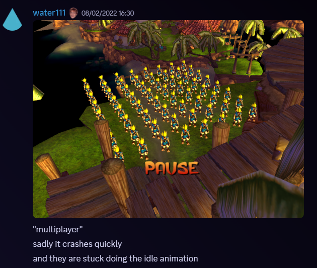

# Jak Multiplayer

In the early days of OpenGOAL development/modding, adding some kind of multiplayer support was of course one of the most common topics to come up. It was surely possible given we had the source code, but there would be a lot of hurdles to get over, and we would see a variety of different approaches over the years.

{/* truncate */}

### Multiple controllers

Online multiplayer obviously comes with the additional challenge of building out the networking and synchronization systems, so in the beginning we focused on local multiplayer, with everything running in a single game instance.

So the first thing we needed to get working correctly was handling inputs from multiple controllers. GOAL already supported reading inputs from the 2nd controller actually, as there are some cheat codes and debug tools that read from it. 

For example, in cheat mode if you press X on the 2nd controller during the rats mini-game `(cpad-pressed? 1 x)` (index 1 because of zero-indexing), it will automatically end the game:

```opengoal
(defstate billy-playing (billy)
  ...
  :code
    (behavior ()
      (loop
        (billy-game-update)
        (if (or (zero? (-> self num-snacks))
                (and (zero? (-> self num-rats)) (-> self passed-last-stage))
                (and *cheat-mode* (cpad-pressed? 1 x)))
          (go billy-done))
```

However despite the PS2 (with Multitap) supporting up to 4 controllers, any inputs on the 3rd or 4th controllers wouldn't be recognized in (Open)GOAL. We were hoping to support at least 4 players locally (I was envisioning a 4-way split-screen view), so we had some work to do here.

On the GOAL side of the code, the controllers are managed via the `*cpad-list*` which has an array of `cpad-info`s. We just needed to bump the size of this array from 2 up to 4, and then adjust the asserts to line up with the new memory layout:

```diff
;; List of controllers. It always has 2 controllers.
(deftype cpad-list (basic)
  ((num-cpads int32       :offset-assert 4)
-   (cpads     cpad-info 2 :offset-assert 8)
+   (cpads     cpad-info 4 :offset-assert 8)  ;; modified from 2->4 for PC 4-pad support
   )
  (:methods
   (new (symbol type) _type_ 0)
   )
  :method-count-assert 9
-  :size-assert         #x10
+  :size-assert         #x18
-  :flag-assert         #x900000010
+  :flag-assert         #x900000018
  )
```

Then in the C++ code, there were some similar bits of code that assumed only 2 controllers, which we extended to support 4:

```diff
/* newpad.h */
-static constexpr int CONTROLLER_COUNT = 2;  // support 2 controllers.
+static constexpr int CONTROLLER_COUNT = 4;  // support 4 controllers.

...

/* newpad.cpp */
struct GamepadState {
-  int gamepad_idx[CONTROLLER_COUNT] = {-1, -1};
+  int gamepad_idx[CONTROLLER_COUNT] = {-1, -1, -1, -1};
+  bool glfw_joystick_used[GLFW_JOYSTICK_LAST + 1] = {false};
} g_gamepads;

...

void check_gamepads() {
  auto check_pad = [](int pad) {  // -> bool
    if (g_gamepads.gamepad_idx[pad] == -1) {
      for (int i = GLFW_JOYSTICK_1; i <= GLFW_JOYSTICK_LAST; i++) {
-        if (pad == 1 && i == g_gamepads.gamepad_idx[0])
+        if (g_gamepads.glfw_joystick_used[i]) {
          continue;
+        }
        if (glfwJoystickPresent(i) && glfwJoystickIsGamepad(i)) {
          g_gamepads.gamepad_idx[pad] = i;
-          lg::info("Using joystick {}: {}, {}", i, glfwGetJoystickName(i), glfwGetGamepadName(i));
+          g_gamepads.glfw_joystick_used[i] = true;
+          lg::info("Using joystick {} for pad {}: {}, {}", i, pad, glfwGetJoystickName(i),
+                   glfwGetGamepadName(i));
          break;
        }
      }
    } else if (!glfwJoystickPresent(g_gamepads.gamepad_idx[pad])) {
-      lg::info("Pad {} has been disconnected", pad);
+      lg::info("Pad {} / joystick {} has been disconnected", pad, g_gamepads.gamepad_idx[pad]);
+      g_gamepads.glfw_joystick_used[g_gamepads.gamepad_idx[pad]] = false;
      g_gamepads.gamepad_idx[pad] = -1;
      return false;
    }
    return true;  // pad already exists or was created
  };
-  if (check_pad(0))
-    check_pad(1);
-  else
-    g_gamepads.gamepad_idx[1] = -1;

+  for (int i = 0; i < CONTROLLER_COUNT; i++) {
+    check_pad(i);
+  }
}

...

void update_gamepads() {
  check_gamepads();

-  if (g_gamepads.gamepad_idx[0] == -1) {
-    clear_pad(0);
-    clear_pad(1);
-    return;
-  }

  ...

-  read_pad_state(0);
-
-  if (g_gamepads.gamepad_idx[1] != -1)
-    read_pad_state(1);
-  else
-    clear_pad(1);
+  for (int i = 0; i < CONTROLLER_COUNT; i++) {
+    if (g_gamepads.gamepad_idx[i] != -1)
+      read_pad_state(i);
+    else
+      clear_pad(i);
+  }
}
```

And voila, now you could successfully connect up to 4 controllers, and read their inputs. For example, to check if the X button was pressed on the 3rd controller: `(cpad-pressed? 2 x)` (2 because of zero-indexing). Or to check if R2 is being held on the 4th controller: `(cpad-hold? 3 r2)`.

### Multiple Jaks

One of the next hurdles we needed to solve was simply being able to spawn multiple instances of `target`, the process used for Jak as a playable character.

water111 actually toyed around with this very early on in OpenGOAL's development (ironically, before water was rendering 😅):



In this case he was just spawning Jak's model as a `viewer` process, meaning it didn't have any of the `target` code attached to it, and just rendered the model in a particular animation.

Normally there is only one `target`, referenced by the global `*target*` variable, and spawned by the `start` function which is called when starting a new game, loading a save, respawning after dying, etc:

```opengoal
(defun start ((arg0 symbol) (arg1 continue-point))
  (set! (-> *level* border?) #f)
  (set! (-> *setting-control* default border-mode) #f)
  (stop arg0)
  (let ((v1-3 (process-spawn target :init init-target arg1 :from *target-dead-pool* :to *target-pool* :stack *kernel-dram-stack*)))
    (if v1-3 (set! *target* (the-as target (-> v1-3 0 self))) (set! *target* #f)))
  *target*)
```

In theory you could spawn multiple `target` processes properly by making multiple of these `process-spawn` calls, but with vanilla code you will immediately crash and see the following in the console logs: `WARNING: target pair had to be allocated from the debug pool, because *target-dead-pool* was empty.`

We need to increase the size of `*target-dead-pool*`, which was written with the assumption there would only ever be a single `target` spawned:

```diff
-(define *target-dead-pool* (new 'global 'dead-pool 1 (* 48 1024) '*target-dead-pool*))
+(define *target-dead-pool* (new 'global 'dead-pool 4 (* 48 1024) '*target-dead-pool*))
```

If we try again to spawn a second `target`, we'll get a slightly different crash and message: `WARNING: sidekick pair had to be allocated from the debug pool, because *16k-dead-pool* was empty.`

`sidekick` here refers to the process for Daxter - we need to make a similar change to the dead pool that he is spawned from:

```diff
-(define *16k-dead-pool* (new 'global 'dead-pool 1 (* 16 1024) '*16k-dead-pool*))
+(define *16k-dead-pool* (new 'global 'dead-pool 4 (* 16 1024) '*16k-dead-pool*))
```

(Later on we discovered we would also need to extend the `*8k-dead-pool*` and `*4k-dead-pool*` in the same way to be able to use the Zoomer, FlutFlut, etc)

Great, now we can spawn multiple `target`s, but by default they will all respect controller 1. This is because `init-target` always assigns `(-> *cpad-list* 0)` as the controller to be used across the `target` code:

```opengoal
(defbehavior init-target target ((arg0 continue-point))
  ...
  (set! (-> self control unknown-cpad-info00) (-> *cpad-list* cpads 0))
```

### Local Multiplayer

As a proof-of-concept, we can just update the controller assignment after spawning additional `target`s to read from one of the other controllers:

```opengoal
(let ((target2 (process-spawn target :init init-target (get-continue-by-name *game-info* "village1-hut") :from *target-dead-pool* :to *target-pool* :stack *kernel-dram-stack*)))
  (when target2
    (set! (-> (the-as target (-> target2 0 self)) control unknown-cpad-info00) (-> *cpad-list* cpads 1))))
```

The camera goes a little crazy when you spawn additional `target`s like this, but aside from that, we now had 2 Jaks running around together, controlled by 2 different controllers - multiplayer!

Now there were still a variety of limitations with this initial version. One obvious one is that everybody shares one view and the camera is focused on only one of the `target`s. Related to this, the game only allows for 2 levels to be loaded at a time. So even if we supported real split-screen, players wouldn't be able to venture off into separate levels unless we refactored the whole level loading system too. For this and various other reasons, we didn't address these issues, and instead focused on getting everything else working in a shared-view local multiplayer.

We quickly found a handful of different behaviors in the game that misbehaved. One common theme was an assumption in the code that there would only ever be one `target`. For example, if anyone died, it would kill everyone off and reload from the last checkpoint, only respawning the first player, `*target*`. Or when player 2 reached a FlutFlut transpad and pressed Circle to get on, it would always send the event to player 1, `*target*`, and they would mount FlutFlut instead.

We started to track of all the `target`s in a global list, and stored each `target`'s index in a field within the `target` object itself. With this, we were able to solve many issues by passing around the index as needed, and looking up the correct `target` from our list, instead of always using `*target*` like the original code.

```opengoal
(define MAX_MULTIPLAYER_COUNT 4)
(define *remote-targets* (new 'global 'boxed-array handle MAX_MULTIPLAYER_COUNT))

(defun get-target ((idx int))
  (if (and (-> *remote-targets* idx) (nonzero? (-> *remote-targets* idx)) (handle->process (-> *remote-targets* idx)))
    (the target (handle->process (-> *remote-targets* idx)))
    (the-as target #f)))
```

A couple of problem areas that needed more debugging and code changes were handling edge grabs, and interactions with water volumes. Without getting into too much detail, the edge grab code relies on some collision checks which cache tons of data in global objects like `*collide-work*` and `*collide-cache*`. These were designed to only hold enough data for a single `target`, but since they were being shared by every spawned `target`, you would get weird behavior like this:

<ReactPlayer controls src={require("./vid/edgegrabs.mp4").default} 
  width="640px"
  height="360px"/>&nbsp;

Similar to the list of `target`s, we extended these systems as needed to hold lists instead of single objects, so each `target` instance had it's own dedicated version. Then we just need to replace all the references to these objects to pull from the list instead, using the specific `target`'s index.

We made a few other small accessibility changes I won't go into detail about here:
- adding a button combo to spawn in a `target` for your controller
- making each `target` a different color
- using a wider camera than the default view
- respawning far-off players back at player 1

And with that, we had a pretty stable shared-screen local multiplayer working!

<ReactPlayer
  controls
  src={"https://www.youtube.com/watch?v=BeVl4x6gjC0"}
  className="blog-video"
  width="640px"
  height="360px"
/>

### Online Multiplayer

The next step here was of course to get this online so you could play with people across the world. 

Steam and Parsec actually have some nice remote play features where the host's screen is shared to other players, and the other player's controller inputs are mapped as additional controllers back on the host's computer. So these tools could immediately be used with the local multiplayer - see this old setup guide Zedb0t put together:

<ReactPlayer
  controls
  src={"https://www.youtube.com/watch?v=JDevUZUVOxQ"}
  className="blog-video"
  width="640px"
  height="360px"
/>&nbsp;

While this was cool, in terms of actual playability, the single camera view was still an incredibly limiting factor. Since we wanted to keep exploring online options, rather than going back to split-screen support, we started thinking about ways to have multiple OpenGOAL instances communicating with each other. This way each player would have their own game running "like normal" with the camera focused on their Jak.

One of the earliest iterations of this is a proof-of-concept Zedb0t built where each OpenGOAL instance posted player positions to a Discord server, and read back other player's positions from that server. Then in each game, the remote player's position would be updated, in this case using the Farmer as a stand-in model.

<ReactPlayer
  controls
  src={"https://www.youtube.com/watch?v=sf3B9n3kuts"}
  className="blog-video"
  width="640px"
  height="360px"
/>&nbsp;

As you can hear Zedb0t and Ruh discussing in the video, the latency was pretty bad when using a Discord server as the "host" for these messages between OpenGOAL instances, but the idea was there.

For the next iteration, we built and hosted a small Python web server that would receive HTTP requests from OpenGOAL and track each connected player's position. We extended the local multiplayer code to periodically send the server our current position, and request the position of all the other players so that we could update them in our local game.

<ReactPlayer
  controls
  src={"https://www.youtube.com/watch?v=3xsrmhqwcF4"}
  className="blog-video"
  width="640px"
  height="360px"
/>&nbsp;

In this way, everyone had their own OpenGOAL instance running with the camera focused on them, but remote players would still be seen moving around in their game. While we were only syncing position/rotation and not properly animating remote players, they were still able to pick up Orbs or Cells if they were in a level that you had loaded locally.

The level loading issue meant there was still de-sync across games if players went to different levels, but overall it was becoming much more playable. While not perfect, the latency in this version was way better than the Discord-based approach. It was even decent enough that we built out a Hide and Seek / Tag gameplay mode!

<ReactPlayer controls src={require("./vid/hns-1.mp4").default} 
  width="640px"
  height="360px"/>&nbsp;

<ReactPlayer controls src={require("./vid/hns-2.mp4").default} 
  width="640px"
  height="360px"/>&nbsp;

Around the same time Zedb0t and I were playtesting this with the community, Dexz revealed that he had been working on his own multiplayer project for OpenGOAL, called TeamRuns! His project was a bit more focused on syncing collectables and game state (e.g. for co-op speedrunning, lockout races. etc), and in this early version you wouldn't actually see other players in your game, only the result of their actions:

<ReactPlayer
  controls
  src={"https://youtu.be/tSxWBSgrx7w?t=31"}
  className="blog-video"
  width="640px"
  height="360px"
/>&nbsp;

Zedb0t and I quickly connected with Dexz to try to work on combining our two projects. TeamRuns used peer-to-peer networking, and had way better latency than our HTTP dedicated server approach since it relied on UDP instead of TCP/IP.

Based on our multiplayer changes, Dexz was able to make changes to his code to allow for spawning multiple `target`s. So he started including player positions in the payloads sent across the network, updating remote `target` positions based on these similar to what we were doing in our previous approach.

A few months later, and Dexz had taken this one step further - he was now syncing animations for remote players as well! It was incredible how much more "real" the multiplayer felt when remote players were punching and rolljumping through your world instead of just sliding and floating around 😅

<ReactPlayer
  controls
  src={"https://www.youtube.com/watch?v=LNPbEm9OLQQ"}
  className="blog-video"
  width="640px"
  height="360px"
/>&nbsp;

And that's more or less how we arrived at the modern version of online Jak multiplayer! 

TeamRuns has a bunch of cool game modes and built-in speedrunning leaderboards. It's since been featured at the European Speedrunner Assembly as well:

<ReactPlayer
  controls
  src={"https://www.youtube.com/watch?v=97oPRXB93n4"}
  className="blog-video"
  width="640px"
  height="360px"
/>&nbsp;

Big shoutout to Dexz for his hard work on TeamRuns, be sure to check it out and play with your friends!

### References

- [PR #1751 - 4 controller support](https://github.com/open-goal/jak-project/pull/1751)
- [Curl Hide and Seek branch](https://github.com/OpenGOAL-Unofficial-Mods/jak-project/tree/curl-hide-and-seek)
- [TeamRuns website](https://teamruns.web.app)
- [TeamRuns repo](https://github.com/JoKronk/teamruns-jak-project)